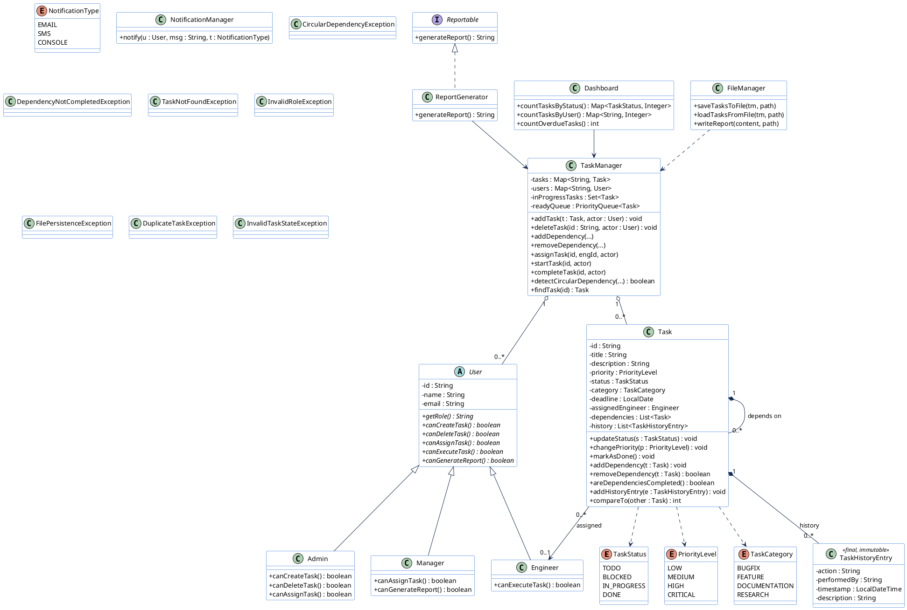
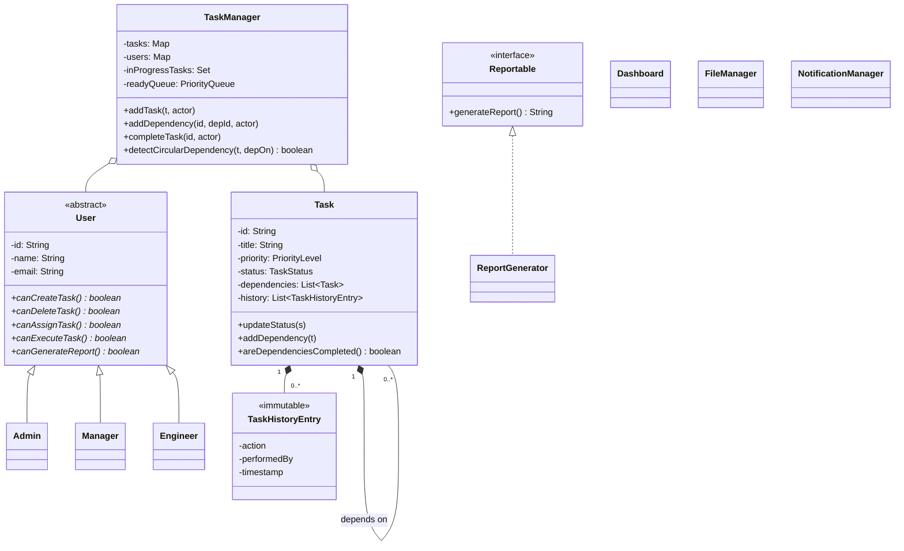
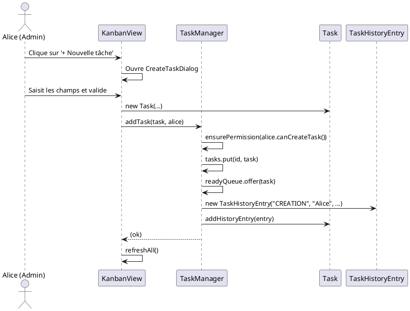
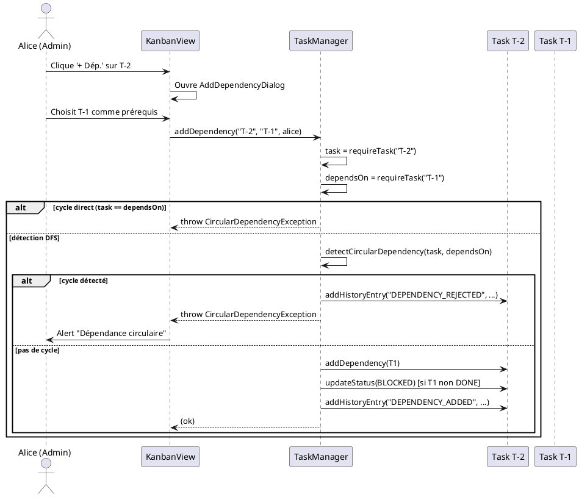
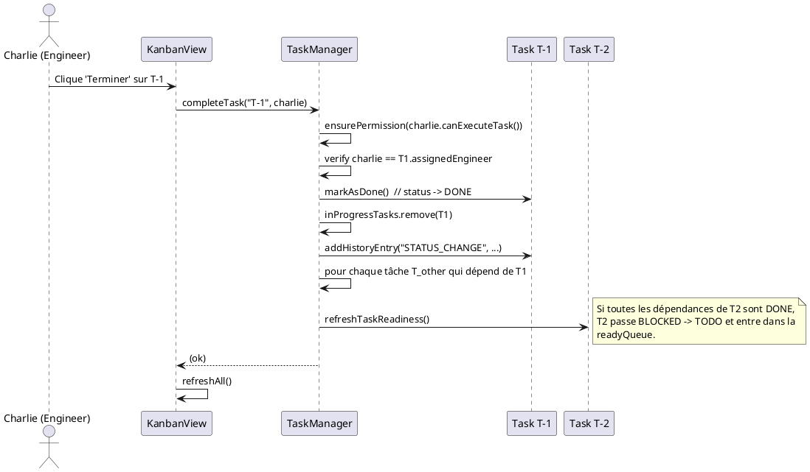
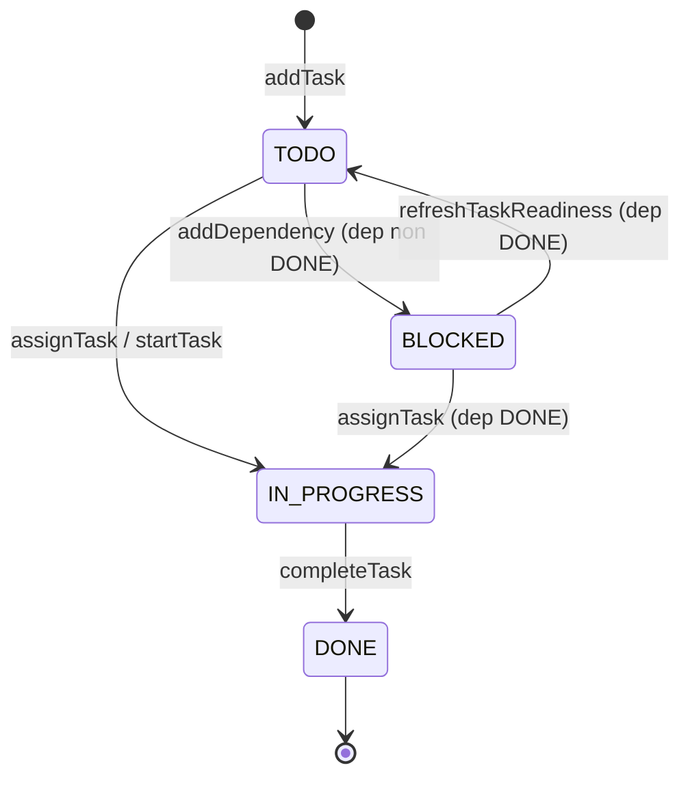

# Diagrammes UML — STRMS

Les diagrammes ci-dessous sont en syntaxe **PlantUML** (copier-coller dans
<https://www.plantuml.com/plantuml/uml/> pour les visualiser) et **Mermaid**
(rendu automatique sur GitHub / GitLab).

---

## 1. Diagramme de classes (PlantUML)

### Aperçu Mermaid (rendu GitHub)

---

## 2. Diagramme de séquence — Création de tâche

---

## 3. Diagramme de séquence — Ajout de dépendance avec détection de cycle

---

## 4. Diagramme de séquence — Complétion d'une tâche

---

## 5. Diagramme de cycle de vie d'une tâche

